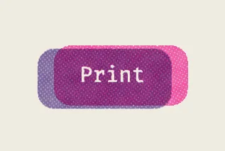
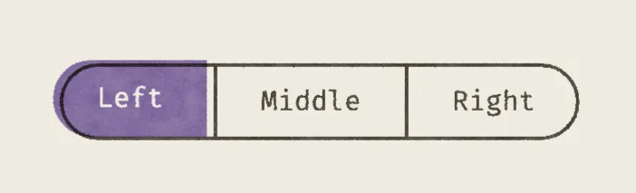

# Riso

A Compose Multiplatform design system modeled on risograph printing: a paper surface, spot-color
ink drums, and passes that land slightly off register.

<table>
  <tr>
    <td align="center"></td>
    <td align="center"></td>
  </tr>
</table>

## Setup

Wrap the app in `RisoTheme`, lay a sheet of paper under the screen and name the inks it prints with:

```kotlin
RisoTheme {
    Column(
        Modifier
            .fillMaxSize()
            .risoPaper()
            .risoInk(RisoTheme.colors.inks.vintageBlack)
    ) {
        Heading1("Pacer")
        Body("Adjust a value and the rest follow.")
    }
}
```

`RisoTheme(effectsEnabled = false)` turns the print effect off: no shaders run and everything draws
flat, in its own colors and in register.

## Follows the `MaterialTheme` pattern

Riso is shaped like `MaterialTheme`, so it reads the way Compose developers expect:

- The `RisoTheme { }` composable provides the values; the `RisoTheme` object reads them:
  `RisoTheme.colors`, `.typography`, `.dimens`, `.shapes` and `.press`.
- The backing `Local*` composition locals are `internal`. Always go through `RisoTheme.*`.

Material is used internally (for example Material's `Text` and `ripple()`), but it is **not exposed**:
`material3` is an `implementation` dependency, and only `compose.foundation` is `api`. Apps use the
Riso components and `RisoTheme` values, never Material directly.

## Risograph

A risograph is a stencil duplicator that prints one spot color per drum. Each color is its own pass
through the machine, and a real print shows it:

- the passes never line up exactly, amplified for effect in this theme
- tones are made of halftone dots, screened at a different angle per drum
- ink lays down unevenly (mottle), with speckle (grain) and a little bleed (spread)
- overlapping inks multiply: pink over blue comes out purple
- the paper stock shows through wherever nothing was printed

The API follows the same model. **Paper** is a modifier, **inks** are modifiers that name the
drums, and the **press** that runs them is part of the theme.

### Paper

```kotlin
Modifier.risoPaper()                                   // the theme's stock
Modifier.risoPaper(RisoPaper(roughness = 0.2f, fiber = 0.3f))
Modifier.risoPaper(RisoPaper.None)                     // no sheet, just ink
```

Paints the sheet behind the content. Only content printed with `risoInk` lands on it as ink: it is
multiplied onto the stock, separated against this sheet's own color, and warped slightly by the
sheet's surface. Anything else — an image, a plain fill — is drawn on top exactly as authored, so
there is nothing to opt out of. Put it once on the screen's root.

- **Stock color:** `colorFront`, `colorBack`. Any color works, and changing it (even animating it)
  costs nothing.
- **Surface:** `contrast`, `roughness`, `fiber` and `fade` set how strongly it shows, and are just
  as cheap to change. `fiberSize`, `scale` and `seed` set its shape.
- **Nested sheets:** a `risoPaper` inside another paints its own stock over the outer one, and the
  ink inside prints onto that.
- **Loading:** the surface is baked once per shape and density into small repeating tiles, at 1×,
  2× or 3× — a denser screen than that reads the 3× tile magnified rather than baking one of its
  own. The default stock's tiles ship with the library, so it appears fully grained on the first
  frame at any density. Other surfaces are baked on first use and cached on disk (except on the
  web); until they land, the stock is drawn flat. Anything that captures a single frame can wait for
  `RisoPaper.isSurfaceReady()`.

### Ink

```kotlin
Modifier.risoInk(inks.purple)
Modifier.risoInk(inks.fluorescentPink, inks.blue)
Modifier.risoInk(listOf(inks.teal, inks.yellow, inks.vintageBlack))
Modifier.risoInk(mix)                                  // a RisoMix, see below
```

Prints everything the composable draws on the named drums, one pass per drum.

- **The drum decides the ink; the artwork decides how much.** Draw in the ink's color (or a tint or
  overprint of it) and it separates onto the drums named. One composable can hold artwork in several
  of its inks.
- **Name the ink as loaded**, for example `RisoTheme.colors.inks.purple`, not `purple.onRisoPaper()`.
  A color that isn't on any drum prints on the closest one the press has.
- **At most three drums** per `risoInk`. Extra inks are ignored.
- **`offsetScale`** scales the misregistration. Use `0f` for small text, where offset hurts
  legibility, and values above `1f` to exaggerate it.
- **Nesting:** the innermost `risoInk` wins. A component keeps its own inks inside a parent's, and
  prints on top of whatever the parent draws behind it.

### Mixing colors

```kotlin
val fill = RisoMix(
    inks.fluorescentPink to .7f,
    inks.purple to .7f,
    unprinted = colors.accent,       // used when effects are off
)

Modifier.background(fill.color()).risoInk(fill)
```

- `RisoMix` is a set of drums with coverages (0..1, like a press's tint scale). `.color()` is the
  color to draw so the press prints exactly that mix, or `unprinted` when effects are disabled.
- `risoOverprint(paper, inks)` does the same for a list of `ink to coverage` pairs. Use it for tint
  ramps and overprint charts instead of blending colors by eye.
- `Color.onRisoPaper(inkCoverage)` shows what an ink looks like once printed on paper.

### Knockout

`Modifier.risoKnockout()` cuts a hole in the enclosing ink pass, so the region shows bare paper, for
example reversed-out text on a filled shape. The hole is cut once for all drums, so the text doesn't
come out doubled. A `risoInk` inside a knockout still prints on the bare paper.

To leave something unprinted, like a photo pasted onto a printed page, just don't put it in a
`risoInk`.

### The press

`RisoTheme.press` is the house style, shared by every print:

| Property               | Effect                                                                        |
|------------------------|-------------------------------------------------------------------------------|
| `inks`                 | The drum rack (`RisoInk`: color, registration offset, screen angle), in order |
| `screen`, `dotSize`    | Halftone amount (0..1) and cell size (dp)                                     |
| `mottle`, `mottleSize` | Uneven laydown and blotch size                                                |
| `grain`, `grainSize`   | Speckle and speckle size                                                      |
| `spread`               | Ink gain beyond the artwork's edges                                           |
| `tolerance`            | How close to the paper color a pixel must be to stay unprinted                |
| `seed`                 | Seed for mottle and grain                                                     |

Each drum's slot fixes its misregistration and screen angle, so an ink looks the same everywhere it
is used. Paper, by contrast, is chosen per call through `risoPaper`.

### With effects disabled

With `RisoTheme(effectsEnabled = false)`:

- `risoPaper` paints the flat stock color
- `risoInk` and `risoKnockout` do nothing
- `RisoPaper.isSurfaceReady()` is always true
- `RisoMix.color()` returns `unprinted` color

